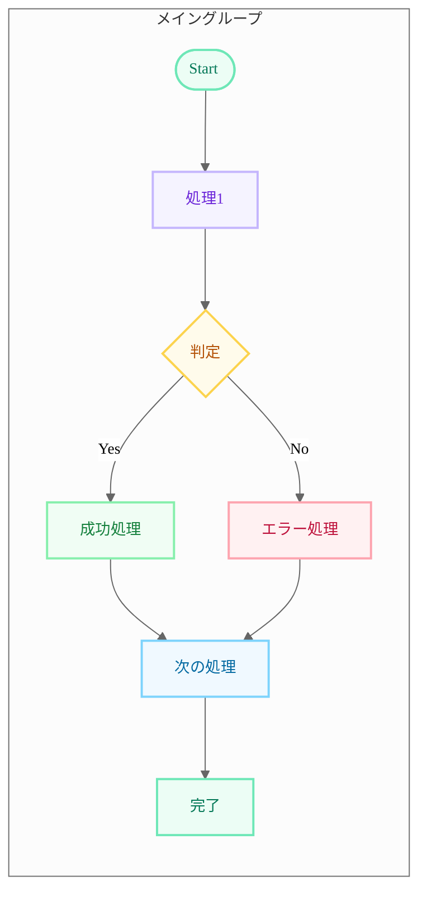
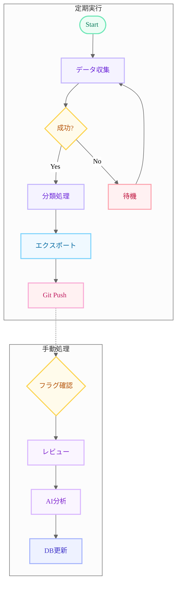

# Mermaid Flowchart Style Guide

## Overview
GitHub READMEにMermaidフローチャートを作成する際の標準スタイルガイド。
パステルカラー + カラフル枠線でモダンなデザインを実現。

## When to Apply
- 「フローチャートを作って」
- 「ワークフローを可視化して」
- 「Mermaidで図を作成して」
- READMEにシステム構成図を追加する時

## Standard Template

## Color Palette Reference

| Class | Fill (背景) | Stroke (枠線) | Text (文字) | Usage |
|-------|------------|---------------|-------------|-------|
| mint | #ECFDF5 | #6EE7B7 | #047857 | 開始/終了/成功 |
| lavender | #F5F3FF | #C4B5FD | #6D28D9 | 通常処理 |
| periwinkle | #EEF2FF | #A5B4FC | #4338CA | DB/データ処理 |
| butter | #FFFBEB | #FCD34D | #B45309 | 判定/分岐 |
| coral | #FFF1F2 | #FDA4AF | #BE123C | エラー/警告 |
| sky | #F0F9FF | #7DD3FC | #0369A1 | 出力/エクスポート |
| rose | #FFF1F2 | #F9A8D4 | #BE185D | Git操作 |
| peach | #FFF7ED | #FDBA74 | #C2410C | フラグ/マーカー |
| lilac | #FAF5FF | #D8B4FE | #7E22CE | AI/分析処理 |
| silver | #F9FAFB | #9CA3AF | #374151 | スキップ/無効 |
| sage | #F0FDF4 | #86EFAC | #15803D | 外部連携/API |
| blush | #FDF2F8 | #F9A8D4 | #9D174D | 分類結果 |
| cloud | #F0F9FF | #93C5FD | #1D4ED8 | ストレージ/DB |

## Design Principles

1. **テーマは `neutral`** - subgraph背景がクリーム系でノードが映える
2. **背景色は淡色 (95%+ 明度)** - 白に近いパステル
3. **枠線はTailwind 300番台** - 淡いが視認性のあるカラー
4. **stroke-width: 2px** - 枠線を少し太くして視認性UP
5. **フォントはsystem-ui** - 読みやすさ重視

## Node Shape Guidelines

- `([...])` - 開始/終了ノード (Stadium shape)
- `[...]` - 通常処理 (Rectangle)
- `{...}` - 判定/分岐 (Diamond)
- `[(...)...]` - データベース (Cylinder)
- `>...]` - 非対称 (Asymmetric)

## Example: Complex Workflow

## GitHub Limitations

- `background` themeVariable は無視される
- `mainBkg` も無視される
- グラデーションは未対応 (PR #5913 がマージされれば将来対応)
- Neo Look / Hand-Drawn Look は Mermaid Chart 専用

## Maintenance

フローチャートの定期更新時:
1. コードベースの変更を確認
2. フローチャートとの差異をチェック
3. 必要に応じて更新
4. README.mdを更新してcommit
