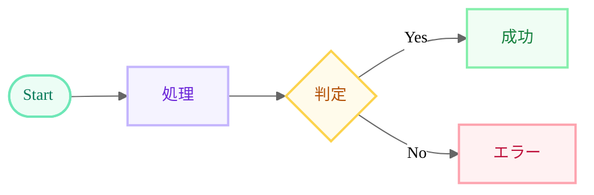

# README Workflow Visualizer

GitHub READMEにMermaidフローチャートを作成・管理するためのClaude Code Skills集。

## 概要

各リポジトリのREADME.mdに、モダンなパステルカラーデザインのMermaidフローチャートを作成・更新するためのスキル定義。

## 機能

- Mermaidフローチャートの標準スタイルガイド
- 13色のパステルカラーパレット
- GitHub READMEで動作確認済みのテンプレート
- 定期更新・メンテナンスガイドライン

## Skills一覧

| Skill | 説明 |
|-------|------|
| `mermaid-flowchart-style.md` | Mermaidフローチャートのスタイルガイド・テンプレート |

## 使用方法

### 1. プロジェクトにSkillsをコピー

```bash
cp -r .claude/skills /path/to/your/project/.claude/
```

### 2. Claude Codeで自動適用

以下のような指示で自動的にスタイルが適用されます:
- 「フローチャートを作って」
- 「ワークフローを可視化して」
- 「READMEにシステム構成図を追加して」

## カラーパレット

| Class | 用途 | プレビュー |
|-------|------|----------|
| mint | 開始/終了/成功 | 薄緑 |
| lavender | 通常処理 | 薄紫 |
| periwinkle | DB/データ処理 | 薄青紫 |
| butter | 判定/分岐 | 薄黄 |
| coral | エラー/警告 | 薄赤 |
| sky | 出力/エクスポート | 薄水色 |
| rose | Git操作 | 薄ピンク |
| peach | フラグ/マーカー | 薄オレンジ |
| lilac | AI/分析処理 | ラベンダー |
| silver | スキップ/無効 | 薄グレー |
| sage | 外部連携/API | セージ緑 |
| blush | 分類結果 | ブラッシュピンク |
| cloud | ストレージ/DB | クラウドブルー |

## サンプル



## 制限事項

- GitHubのMermaidレンダラーは `background` / `mainBkg` を無視
- グラデーションは未対応
- Neo Look / Hand-Drawn Look は Mermaid Chart 専用

## 参考

- [Mermaid公式ドキュメント](https://mermaid.js.org/)
- [ai-buzz-extractor実装例](https://github.com/Tenormusica2024/ai-buzz-extractor/blob/gh-pages/README.md)
